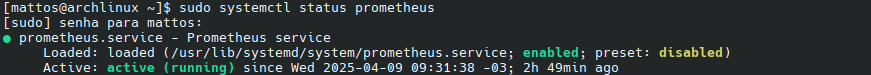

# OpenTelemetry

## Table of contents
1. [What is OpenTelemetry?](#what-is-opentelemetry)
2. [Concepts](#concepts)
3. [Getting started with OpenTelemetry on Python](#getting-started-with-opentelemetry-on-python)
4. [Glossary](#glossary)

## What is OpenTelemetry?
OpenTelemetry is an observability¹ framework and toolkit designed to facilitate the **generation**, **extraction** and **collection** of telemetry² data.

**Warning:** OpenTelemetry is **not** an observability backend on itself.

## Concepts
### Architecture
OpenTelemetry is composed of microservices³ that communicate with each other via gRPC⁴ and HTTP.

#### Learn more
[OpenTelemetry's architecture](https://opentelemetry.io/docs/demo/architecture/)

### Signals
The data utilized by OpenTelemetry.

They are **system outputs** that describe the operation of a system.

Currently, OpenTelemetry supports the following types of signals:
1. Traces: The path of a request through the application.
2. Metrics: A measurement captured at runtime.
3. Logs: A recording of an event.
4. Baggage: Contextual information passed between signals.

### Context propagation
Allows for signals to be correlated to each other. That way, traces can build information about a system across services.

In OpenTelemetry, **context** is an object which receives information pertaining the sender and the receiver of a signal. In that case, context **propagation** is the mecanism which moves context across services, serializing or deserializing information the context object and provides the relevant information to transmitted from a service to another.

### Components
Currently, OpenTelemetry is made of several components:
1. [Specification](#1-specification)
2. [Collector](#2-collector)
3. [Language-specific API and SDK implementations](#3-language-specific-api-and-sdk-implementations)
4. [Kubernetes operator](#4-kubernetes-operator)
5. [Function as a Service assets](#5-function-as-a-service-assets)

#### 1. Specification
Cross-language requirements and expectations.
+ API: Data types and operating for generating and correlating [signals](#signals)
+ SDK: Requirements for a language-specific implementation of the API, configuration, data processing and exporting concepts
+ Data: OpenTelemetry Protocol (OTLP) and vendor-agnostic semantics

#### 2. Collector
A vendor-agnostic proxy that can receive, process, and export telemetry data.

It can support various file formats for telemetry data, such as:
+ Prometheus
+ OTLP
+ Jaeger

#### 3. Language-specific API and SDK implementations
OpenTelemetry has language-specific SDKs (software development kits) that allow you to use the OTel API to generate telemetry data and export it to your preferred backend.

They also let you incorporate instrumentation libraries for common libraries and frameworks that you can use to connect to manual instrumentation in your application.

+ Instrumentation libraries: OpenTelemetry supports a broad number of components that generate relevant telemetry data from popular libraries and frameworks for supported languages.

+ Exporters: An intermediate between an application and the backend to which you want to export the data. It's best practice to use them in production environments. OTLP exporters are designed with the OpenTelemetry data model in mind, emitting OTel data without any **loss of information.** Furthermore, many tools that operate on telemetry data support OTLP.

+ Zero-code instrumentation: Provides a way to instrument an application without touching its source code (when applicable).

+ Resource detectors: A resource represents an entity producing telemetry as resource attributes. The language specific implementations of OpenTelemetry provide resource detection from the OTEL_RESOURCE_ATTRIBUTES environment variable and for many common entities, like process runtime, service, host, or operating system.

+  Cross-service propagators: Context propagation happens through instrumentation libraries. If needed, you can use propagators yourself to serialize and deserialize cross-cutting concerns such as the context of a span and baggage.

+  Samplers: Processes that restrict the amount of traces generated. Each language-specific implementation of OTel offers its own head samplers.

#### 4. Kubernetes operator
Manages the OpenTelemetry Collector and auto-instrumentation of the workloads using OpenTelemetry.

#### 5. Function as a Service assets
OpenTelemetry supports various methods of monitoring Function-as-a-Service provided by different cloud vendors.

## Getting started with OpenTelemetry on Python
This folder includes a small demonstration of the practical applications of OpenTelemetry.

It is a small application that collects the CPU and RAM usage of your machine every 5 seconds and exports it to a Prometheus backend server.

To run it, follow these steps:
### 1. Install necessary libraries
```bash
source venv.sh
```

#### 1.1.1 Install Prometheus
```bash
sudo pacman -S prometheus
```

#### 1.1.2 Modify /etc/prometheus/prometheus.yml
Modify the **global** and **scrape_configs** sections based on the example provided in **src/prometheus.yml**.

#### 1.1.3 Enable Prometheus (if you have just installed it)
```bash
sudo systemctl enable --now prometheus
```

#### 1.1.4 Restart Prometheus (if you had it running and modified prometheus.yml)
```bash
sudo systemctl restart prometheus
```

#### 1.1.5 Verify Prometheus is running
```bash
sudo systemctl status prometheus
```

You should see something like this:



### 2. Begin monitoring
```bash
prometheus --config.file=prometheus.yml
python3 main.py
```

#### 2.1 Observe results
Go to http://localhost:8001/metrics to see the Prometheus server.

Go to http://localhost:9090 to use Prometheus' GUI to see and query results.

### 3. Stop monitoring
Press CTRL + C.

## Glossary
1. Observability: The ability to learn about a system's status at a point in time by asking questions about it.
2. Telemetry: The collection and transmission of the performance data of a device or product.
3. Microservices: A type of software architecture which divides a bigger application into serveral smaller ones, each one self-sufficient, independent and representing one _responsibility_. The parts usually communicate with each other using APIs. 
4. gRPC: Google Remote Procedure Control (gRPC) is an open code framework for communication between systems.