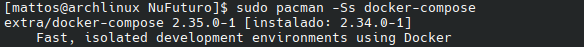

# Collecting metrics from multiple machines with OpenTelemetry

## Architecture
Basically, one machine will be a server, which will collect the metrics from the other machines and expose them to a local Prometheus instance.

This code currently assumes all machines are in the same network and can communicate with one another.

## Collecting metrics
## 1. Server side
### Preparing the environment
Run the following command:
```bash
source env.sh
```

This command fetches your machine's IP address and updates .env with it. Make sure to update the machines you want to monitor's .env files with **your** address.

#### Install Docker Compose
First, let's make sure docker compose is installed. Open a new terminal (CTRL+ALT+T), then run:
```bash
sudo pacman -Ss docker-compose
```

You should see something like this:



If it's not installed, run:
```bash
sudo pacman -S docker-compose
```

#### Pull an image of OpenTelemetry Collector
In this project, OpenTelemetry Collector Core is being used.

```bash
sudo docker pull otel/opentelemetry-collector
```

#### Run OpenTelemetry Collector
Then, all you have to do is run the following command:
```bash
./run_project.sh -s
```

To stop the OpenTelemetry Collector container, run:
```bash
./run_project.sh -s -d
```

## 2. Client side
### Set up environment variables
Run the following command:
```bash
source env.sh
```

Then, replace the IP address in `IP_ADDR` with your server's IP address.

### (Optional) Make sure the server is reachable
Replace `central_collector_IP` in the following command with your server's actual IP address.
```bash
ping central_collector_IP
```

If it fails, make sure your machine is in the same network as the server machine.

### Collect metrics
```bash
./run_project.sh -c
```

To stop monitoring, run:
```bash
./run_project.sh -c -d
```

## More information
+ If you altered `app_collector_local.py` and would like to run it again, first, make sure to **rebuild** the image:
```bash
./run_project.sh -b
```

+ If you want to run the benchmarks `/benchmarks`, make sure to enable benchmark mode:
```bash
source env.sh -b
```